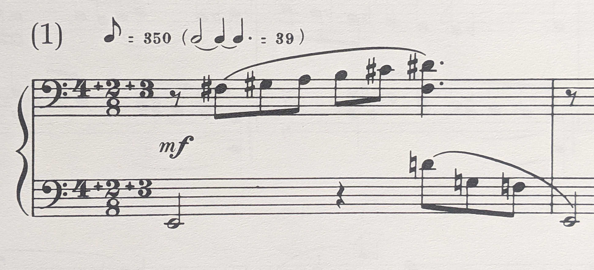

# Asymmetronome

Asymmetric metronome.

## Features

- Tap to set tempo.
- Drag to change tempo.
- Subdivide rhythm into groups of beats (aka Bartok mode: e.g., 4 + 2 + 3).
- For iOS or Android.

I wrote this app to help practice the Six Dances in Bulgarian Rhythm at the end
of Book 6 of the Mikrokosmos, by Bartok:

A standard metronome isn't a great help here, since your choices are either a
click on every beat in the measure (at at 350 bpm, this is thankfully
impossible on a typical metronome; perhaps a sewing machine would be better),
or the first beat of every measure, which, though it might help with overall
timing and balance, is useless for getting the feel of the rhythm and the way
the music plays against it.

This app lets you subdivide the rhythm into groups of beats, with stress
falling on the first beat of each group. For this Bartok piece, you set bpm to
350 and set the pattern to 4 + 2 + 3 + 0.

The 0 at the end has no metrical value; it gives you something to put your
finger on and drag to increase the number of groups of beats. Dragging a value
to 0 clears out all following groups. So 4 + 0 + 3 + 3 turns into 4 + 0.

To use it as a normal metronome, just set the stress pattern to 1 + 0.
 

## License

The HandDrum sample is from the Berklee College of Music [samples
v.1](https://archive.org/details/Berklee44v1) collection.

This project is licensed under the terms of the MIT license.

