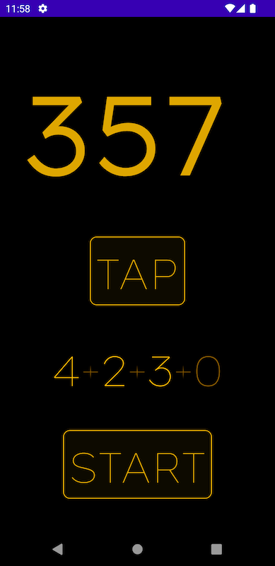

# Metronome

## Features

- A useful metronome
- Tap to set tempo
- Drag to change tempo
- Fancy ability to subdivide rhythm (Bartok mode: e.g., 4 + 2 + 3)

## License

The HandDrum sample is from the Berklee College of Music [samples
v.1](https://archive.org/details/Berklee44v1) collection.

This project is licensed under the terms of the MIT license.

